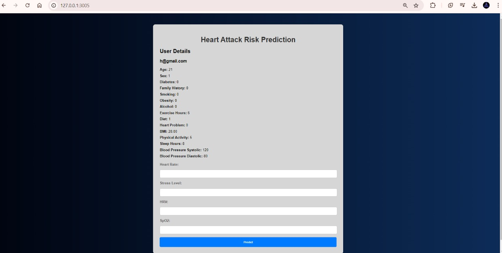

# Quad Cure

**Quad Cure** is an innovative healthcare platform designed to reduce the heart attack death rate in India, currently at 33%, through early detection and intervention. This platform provides a comprehensive solution for detecting potential heart issues using just a webcam and minimal user input, leveraging advanced technologies such as Eulerian Video Magnification (EVM).

## Table of Contents

1. [Overview](#overview)
2. [Key Features](#key-features)
3. [Technology Stack](#technology-stack)
4. [Installation](#installation)
   - [Prerequisites](#prerequisites)
   - [Step 1: Clone the Repository](#step-1-clone-the-repository)
   - [Step 2: Setting Up the Website](#step-2-setting-up-the-website)
   - [Step 3: Setting Up the Machine Learning Service](#step-3-setting-up-the-machine-learning-service)
5. [Usage](#usage)
6. [Contributing](#contributing)
7. [License](#license)
8. [Contact](#contact)
9. [Snapshots](#snapshots)

## Overview

The Quad Cure platform measures vital parameters, including heart rate, HRV (Heart Rate Variability), blood pressure, oxygen saturation, and stress levels, to provide users with actionable health insights. In addition to these physiological measurements, users can complete a self-assessment questionnaire to evaluate their mental and physical health. Based on this data, the system generates a detailed report predicting the probability of a heart attack and offering guidance for preventive care. In critical cases, users can connect directly with a doctor through the platform for immediate assistance.

## Key Features

1. **Webcam-Based Vital Sign Measurement**: Measure heart rate, HRV, blood pressure, oxygen saturation, breathing rate, and parasympathetic activity using your webcam.
2. **Stress Level Detection**: Analyze stress levels through HRV and Electrodermal Activity (EDA) data utilizing EVM technology.
3. **Comprehensive Health Assessment**: A self-assessment that considers factors such as smoking, alcohol consumption, diabetes, and drowsiness, contributing to the overall health score.
4. **Detailed Health Report**: Generate a graphical and numerical report displaying vital signs, health scores, and heart attack probability predictions.
5. **Doctor Connectivity**: Easily connect with a doctor for immediate medical attention in critical situations.

## Technology Stack

- **Frontend**: HTML, CSS, JavaScript
- **Backend**: Flask (Python)
- **Machine Learning**: Python (TensorFlow, scikit-learn)
- **Technologies**: Eulerian Video Magnification (EVM), Machine Learning Algorithms

## Installation

This project is divided into two main components: the Website and the Machine Learning (ML) service. Both components need to be set up and run separately.

### Prerequisites

- Python 3.10+
- Flask
- TensorFlow
- scikit-learn
- OpenCV
- Other required Python libraries


## Usage

Once the installation is complete, you can start using the Cardio Care application. Here’s how:

1. **Sign Up**: Create an account using your email and password.
2. **Upload Reports**: Upload your health reports in PDF format to analyze your heart health.
3. **View Predictions**: After analysis, view your heart attack risk predictions based on your health parameters.
4. **Consult Doctors**: Use the app to connect with healthcare professionals for consultation regarding your health.
5. **Track Progress**: Monitor your heart health over time with regular updates and reports.

## Configuration

Ensure that your Cardio Care project is properly set up. Follow these steps:

1. **API Key**: Obtain an API key for the EleutherAI API to access the diet and lifestyle planning features.
2. **Database Configuration**: Configure the database settings for storing user data and health reports.
3. **Environment Variables**: Create a `.env` file in the root directory of your project and add the following configuration values:

   ```plaintext
   ELEUTHERA_API_KEY=YOUR_API_KEY
   DATABASE_URL=YOUR_DATABASE_URL

### Step 1: Clone the Repository

Clone the repository to your local machine:


git clone https://github.com/Hruthwik-68/Cardio_Care.git
cd Cardio_Care
Step 2: Setting Up the Website
Navigate to the website directory:


cd website
Install the required dependencies.

Run the Flask application:


python app.py
Note: Ensure that you have set up the SQL databases and Appwrite configurations.

The website will be hosted locally at http://127.0.0.1:5000/. You can access it in your browser.

Step 3: Setting Up the Machine Learning Service
Navigate to the ML folder:


cd ../ml
Install the required dependencies.

Run the Machine Learning service:


python app.py
The ML service will be hosted locally at http://127.0.0.1:3005/. This service processes the vital signs and health assessments collected from the website.

Usage
Access the Website: Open the local server URL http://127.0.0.1:5000/ in your browser.
Login or Register: Start by registering or logging into your account.
Perform a Scan: Use your webcam to capture vital parameters such as heart rate, stress levels, blood pressure, and more.
Self-Assessment: Complete a simple health-related questionnaire to generate a comprehensive report.
View Report: After the scan and self-assessment, the platform generates a detailed report with health scores and risk analysis.
Consult a Doctor: If a critical condition is detected, connect with a doctor through the platform for immediate assistance.
Contributing
Contributions are welcome! If you’d like to contribute, please submit a pull request or open an issue in the GitHub repository.

License
This project is licensed under the MIT License. See the [LICENSE](./LICENSE) file for details.


Contact
For more information or queries, please contact the project owner:

Hruthwik M
[LinkedIn](https://www.linkedin.com/in/hruthwik-m) | [GitHub](https://github.com/Hruthwik-68)


SnapShots :


1. Flowchart of the Project :
 
  


2. Signup And Login Pages :
 
  

  


3. Home Page :

  
  


4. Scanning Page :

   
  


5. Assessment Page :

   
  


6. Graph as output :

   
  


7. See graph as Output in Website :

   
  


8. Prediction Page :

   
  


9. Final Result Page :

   
  


9. Downloaded Report as pdf :

   
  


9. Doctor Consulting page with automatic location tracking :

   
  


